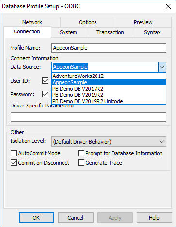
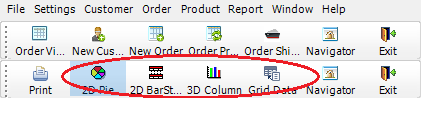
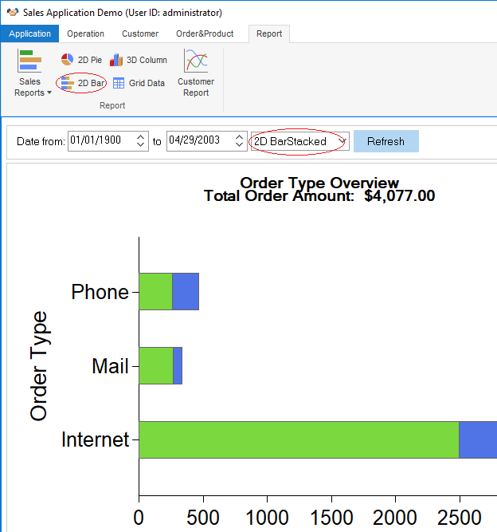
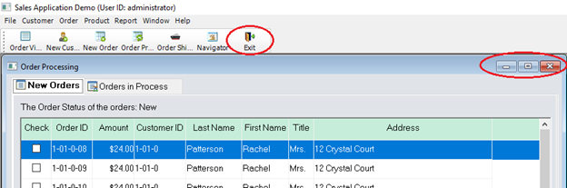
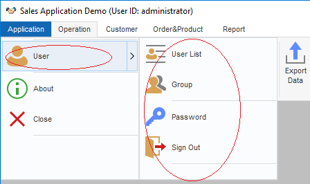

# How to Replace an Application Menu with a RibbonBar

Overview
--------

The new RibbonBar control allows you to organize the navigation of your application in a simple, structured way, and gives the application the look and feel of modern applications. Because RibbonBar is provided in PowerBuilder as a control while Menu is a system object, the way that a RibbonBar works in an application is different from the application menu. This tutorial uses a demo application to walk you through the steps of replacing an application menu with a RibbonBar.

The figure below shows what the menu looks like in the original demo application.


The figure below shows what the RibbonBar control looks like after you use it to replace the menu in the application.


This tutorial contains the following sections:

- [Prerequisites](#prerequisites)

  This explains how to set up the demo application used in the tutorial.

- [Design and create a RibbonBar](#design-and-create-a-ribbonbar)

  You shall have a clear understanding of your application to know how to design and create a RibbonBar for it.

- [Add the RibbonBar to the application](#associate-functions-with-ribbonbar-items)

  The RibbonBar will replace the existing menu in the application. Therefore, you must disable the existing menu before adding the RibbonBar.

- [Initiate the RibbonBar](#initiate-the-ribbonbar)

  This explains how to initiate the RibbonBar created by XML or by PowerScript.

- [Associating functions with RibbonBar items](#associate-functions-with-ribbonbar-items)

  Previously the application functions are all associated with menu items. You need to decide which function to associate with which RibbonBar item.

- [More RibbonBar techniques with examples](#more-ribbonbar-techniques-with-examples)

  This section provides a few techniques, with examples, on how to present the RibbonBar and its items in the desired way.

- [Summary notes](#summary-notes)

  Finally, this section highlights the major points you should consider when you start to replace the menu in your application with RibbonBar.

Prerequisites
-------------

- PowerBuilder 2019 R2

- Download the RibbonBar demo application from <https://github.com/Appeon/PowerBuilder-RibbonBar-Example>.

- Sample database setup: setting up ODBC database connection

  1. Open Control Panel \> Administrative Tools \> ODBC Data Sources (64-bit)
  2. Create a new Data Source in SQL Anywhere 17
  3. Fill in the data source settings. You can get the database file “AppeonSample.db” in the downloaded source files.The username and password for data source connection is ‘dba/sql’

  

  4. In PowerBuilder, setup and connect to the created ODBC data source

  


Design and create a RibbonBar 
------------------------------

As the first step, you shall design the RibbonBar, that is, deciding what items to contain in the RibbonBar, what modern-looking image to use for each item, and how to group the items, etc.

Once you know clearly how you want the RibbonBar to look like, you can start to create it. We recommend you use the RibbonBar Builder tool to create the RibbonBar XML file. Alternatively, you can choose to directly create a RibbonBar via PowerScript.

For detailed instructions on how to create a RibbonBar, refer to PowerBuilder Help \> RibbonBar control. In the Sales Demo application, for better illustration purpose, you will see both the XML file and PowerScript code are provided for create the RibbonBar. 

**Creating the XML for the RibbonBar in this demo (Recommended):**

A dedicated tool, RibbonBar Builder, is available in PowerBuilder to assist you to create the RibbonBar XML. In the tool, you can use a template (RibbonBar.xml) for creating your own XML, and preview the RibbonBar UI while you work. This is the recommended approach.

In the Sales Demo application:

-   Open Tools \> RibbonBar Builder in PowerBuilder IDE, and open and edit the file created for the RibbonBar: *SalesApplicationDemo_RibbonBar.xml*.

**Creating the PowerScript for the RibbonBar in this demo:**

In the Sales Demo application:

- Open the function w_mdi.wf_init_ribbonbar, and you will see the PowerScript for the RibbonBar in the function. The script is different from XML, but shall still be easy to understand.

  For example, the following script inserts File as a RibbonBar category, add a orderview panel in this category, and then add buttons inside the panel.

  ```c++
  //File menu
  long ll_handle,ll_category,ll_panel,ll_group
  RibbonSmallButtonItem lrs_item
  Ribbonmenu lrm_menu
  ribbonLargeButtonItem lrl_item
  ribbongroupitem lrg_item
  long ll_return,ll_tmp,ll_tmp2
  ll_category = arbb.insertcategoryfirst("File") //Insert a category
  
  //orderview
  ll_panel = arbb.insertpanellast( ll_category, "OrderView","orderview.png") //Insert a panel
  arbb.insertLargebuttonlast(ll_panel,"Orders","orderview.png","ue_orderview") //Insert button
  arbb.insertLargebuttonLast(ll_panel,"Print","printbig.png","ue_orderview_print")
  ```

Add the RibbonBar to the application
------------------------------------

### Replacing the existing menu with an empty one

After the RibbonBar is applied, the previous menu will no longer be used in the application. We shall use an empty menu to replace the previous application menu assigned to the MDI window.

1.  Use New \> PB Object \> Menu to create a new menu object. It is unnecessary to define any menu item for the menu or attach any script to it. If you do add a menu item, make sure the item shall be set to invisible.

2.  Assign the empty menu to the MDI window.

In the Sales Demo application, we created the menu object m_mdi_none and assigned it to mdi_1. The menu object contains one main menu and one submenu. Note that the submenu item is set to invisible.

### Inserting a RibbonBar control to the MDI window

Insert the RibbonBar control object into the MDI window. Note that you must resize the width and height for RibbonBar area in correspondence with the MDI client area to make sure the RibbonBar fits well in the MDI window.

In the Sales Demo application:

1. Insert the RibbonBar control into the MDI window mdi_1

2. Add the following resize() code to resize the RibbonBar and the MDI window:

   ```C++
   //resize RibbonBar
   rbb_1.move(0,newheight - this.workspaceheight() )
   rbb_1.width = newwidth
   
   //resize mdi_1 based on RibbonBar
   mdi_1.move(0,rbb_1.height +newheight - this.workspaceheight())
   mdi_1.resize(newwidth,newheight - rbb_1.height - ( newheight - this.workspaceheight()))
   ```

### Disabling ControlMenu in sheet windows

Because the RibbonBar control applies to the whole application, it is no longer necessary to provide the Control Menu in sheet windows. To make sure the sheet window still provides the Close button after the Control Menu is removed, the new RibbonBar shall contain the Close/Exit button.

In the Sales Demo application:

1.  Go to every sheet window (for example, w_sheet), and uncheck the ControlMenu property in General property of the window.

2.  Add the close/exit button in the RibbonBar top-right corner when we [Design and create a RibbonBar](#design-and-create-a-ribbonbar).

Initiate the RibbonBar 
-----------------------

In the [Design and create a RibbonBar](#design-and-create-a-ribbonbar) section, we used two ways to createtheRibbonBar for the application: by XML or PowerScript. We can choose to initiate the RibbonBar created in either way.

### Initiating the RibbonBar created by XML

In the Sales Demo Application:

1. Add an instance variable in the MDI window.

   ```c++
   String is_Ribbonbar_XML_Name = "SalesApplicationDemo_RibbonBar.xml"
   ```

   Initiate RibbonBar menu in the MDI window open() event. The second argument is True, indicating that the RibbonBar will be initiated using XML:

   ```c++
   wf_init_ribbonbar(rbb_1,True)
   ```

   In the function wf_init_ribbonbar of MDI window, load the RibbonBar from theXML file with the following code:

   ```c++
   If ab_LoadXML Then
     arbb.LoadFile(is_Ribbonbar_XML_Name)
     return
   End If
   ```

### Initiating the RibbonBar created by PowerScript

In the Sales Demo Application:

- Initiate RibbonBar menu in the MDI window open() event. The second argument is False, indicating that the RibbonBar will be initiated using PowerScript:

  ```c++
  wf_init_ribbonbar(rbb_1,False) 
  ```

## More RibbonBar techniques with examples

Previously the application functions are all associated with menu items. You need to decide which function to associate with which RibbinBar item now. In the Sales Demo application, you can see clearly how a function that is previously associated with a menu item is now associated with a RibbonBar item. In this tutorial, let’s explain a few techniques with examples.

### Example 1– Opening the “By Order Type” report

In the original application, the “By Order Type” report is opened from Report \> By Order Type menu item.


The new application uses the Report \> Sales Reports \> By Order Type RibbonBar item to open the report instead.


**PowerScript in the previous menu item m_report1.m_salesreports.m_byordertype:**

```c++
str_rptparm lstr_parm
lstr_parm.ftitle = 'Sales Report by Order Type'
lstr_parm.fdataobject = ""
opensheetWithParm(w_rpt_order_type,lstr_parm , parentwindow , 0 , Original!)
```

**PowerScript in the event ue_rep_ordertype of the RibbonBar:**

```c++
str_rptparm lstr_parm
lstr_parm.ftitle = 'Sales Report by Order Type'
lstr_parm.fdataobject = ""
opensheetWithParm(w_rpt_order_type,lstr_parm , parent , 0 , Original! )
iw_tmp = w_rpt_order_type
wf_setstyle("2D BarStacked")
```

**Key points covered in the PowerScript change:**

- *opensheetWithParm(w_rpt_order_type,lstr_parm , parent , 0 , Original! )*

  As the report item is placed in RibbonBar panel, the parent object for this item is changed. The mdiframe argument of OpenSheetWithParm is changed from parentwindow to parent. The Tag value is migrated into the this RibbonBar item. You can find more information for Tag migration in next example.

- *iw_tmp = w_rpt_order_type*

  The original toolbar items are migrated as RibbonBar items (small buttons), e.g. 2D Pie, 3D Column, 2D BarStacked/Line and Grid Data items. The items may be enable or disable depending on the activation of Sheet window. Here we add each opened window into a buffer to track the activation status, so that it can control the status for the RibbonBar items.

- *wf_setstyle("2D BarStacked")*

  Identify if the report supports 2D BarStacked or 2D Line style. In this example, the small button “2D Bar” is displayed when this report is actively opened.

### Example 2 – Opening the “2D BarStacked” report

In the original application, the “2D BarStacked” report is opened from the “2D BarStacked” toolbar item.



The new application uses the Report \> 2D Bar RibbonBar item to open the “2D Bar” report, and then provides the 2D BarStacked option in the report for users to view the 2D Bar Stacked report.



**PowerScript in the previous toolbar item m_report.m_settings.m_defaultsettings.m_reportstyle.m_item1:**

```c++
ParentWindow.Dynamic Event ue_Settings(This.Tag)
If This.Checked Then Return
This.Checked = True
m_item3.Checked = False
m_item4.Checked = False
m_item5.Checked = False
```

**PowerScript in the event ue_report_style of the RibbonBar:**

```c++
ribbonsmallbuttonitem lrs_item
this.getsmallbutton( al_handle, lrs_item)
string ls_tag
ls_tag = lrs_item.tag
if isvalid (iw_tmp) then
	iw_tmp.dynamic event ue_Settings(lrs_item.tag)
end if
```

**Key points covered in the PowerScript change:**

-   The Checked status for the toolbar item is no longer applicable for RibbonBar item.

```c++
ribbonsmallbuttonitem lrs_item
this.getsmallbutton( al_handle, lrs_item)
string ls_tag
ls_tag = lrs_item.tag
```

- The Tag property is used as identifier for some business logic of toolbar items. The Tag value need to be migrated into the RibbonBar item. In this example, we use handle to obtain the Tag value from a RibbonBar item. The report style will be switched based on the Tag value.


```c++
if isvalid (iw_tmp) then
	iw_tmp.dynamic event ue_Settings(lrs_item.tag)
end if
```

- The parent window is not applicable for RibbonBar items, and the parent object is not applicable for RibbonBar either. The parent window is an MDI window instead of a sheet window, and the actual parent object will be the tracked sheet window in the buffer. The buffer is maintained in the object iw_tmp.


### Example 3 – Replacing the Close/Exit in sheet windows

In original MDI window application, the control menu provides the Close button to close the Sheet window, and the Exit button to close the application.



When we apply the RibbonBar, the ControlMenu property is disabledinthe sheet windows. The open, close and refresh functions are now provided in the RibbonBar instead.


**PowerScript in the previous w_sheet object close() event:**

```c++
parentwindow().post dynamic event ue_closesheet(this.classname())
```

**PowerScript in the w_sheet object close() event of the RibbonBar:**

```C++
parentwindow().post dynamic event ue_closesheet(this.classname())
if isvalid(w_mdi) then
	sw_mdi.post function wf_refresh_ribbon()
end if
parentwindow().post function Arrangesheets(Layer!)
```

**Key points covered in the PowerScript change:**

- *w_mdi.post function wf_refresh_ribbon()*

  In the Close event of the sheet window, call the wf_refresh_ribbon function to refresh the RibbonBar buttons and controls in the MDI window at the closing of the sheet window w_mdi function. For example, if the 2D BarStacked report window is closed, the current active report supports 2D Line style. The style button in the RibbonBar is refreshed to display the2D Line button.

- *parentwindow().post function Arrangesheets(Layer!)*

  In the Close event of the sheet window, call the ArrangeSheets function to re-arrange all the remaining sheet windows via the Layer parameter.

### Example 4 – Adding the Application Menu category 

The Application Menu category contains the generic application functions, including:

- Recent Windows, listing the recently opened windows;

  

- User, providing the user/group management, password setting, and signout functions;

  

### Example 5 – Including special RibbonBar widgets 

There are some special RibbonBar widgets that can further enhance user experience in the application.

For example, the standard RibbonBar buttons for collapsing and expanding, help, and closing functions, as shown below:


### Example 6 – Adding shortcut keys 

It is possible to set shortcut keys for RibbonBar buttons.

To set the shortcut key in XML: 

```xml
<SmallButton Text="" Tag="ModifyRow" PictureName="ModifySmall" Clicked="ue_modify" Shortcut="ctrl+M"/>&gt;
```

To set the shortcut key in PowerScript:

```c++
lrbb_SmallButton.ShortCut = "ctrl+M"
```

### Example 7 - Loading different RibbonBar XML to different windows

In the rbb_1.ue_ribbonbar_display_refresh function of the w_mdi window, a CASE statement is used to load different RibbonBar XML to different windows:

```c++
If	ib_LoadXML	Then
Choose Case as_windowclassname
	Case "w_order_viewer","w_rpt_order_date_summary","w_rpt_order_customer_summary"
		this.ImportFromXMLFile("SalesApplicationDemo_RibbonBar_orderview.xml")
		Return
	Case "w_customer_maintenance","w_order_main","w_product_edit"
		this.ImportFromXMLFile("SalesApplicationDemo_RibbonBar_CustomerMaintenance.xml")
		Return
	Case else
End	Choose
End	If
```

Summary notes
-------------

- The RibbonBar can be constructed by a standard XML file. PowerBuilder provides RibbonBar Builder with preview functionality to assist you to create the XML file.

- When you apply a RibbonBar to an application, the previous menu in the application shall be removed. It is recommended that you create an empty menu and assign it to the MenuName property of the MDI window of the application.

- The ControlMenu property must be disabled for all windows in the application, so that the ControlMenu titlebar won’t display when a sheet window is maximized.

- Remember to resize the width and height for RibbonBar area and the MDI client area after the RibbonBar is added to the MDI window. This is to make sure the sheet windows opened in the MDI window will display properly together with the RibbonBar.

- If some windows are inherited from an ancient window, you can follow the same way to associate functions with the child windows as with the ancient window.

  If previously some menu items with same functionality are placed in different sheet windows and you plan to put the menu items in the same panel in the RibbonBar, you can consider to control the enable/disable statuses of the RibbonBar items depending on the active status of the sheet windows.
